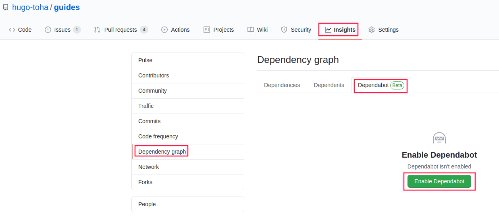

# :arrow_down: Installation

`libbash` can be installed as a [git submodule][1] in the directory with the script for ease of updating.

```shell title="Project layout"
myproject/
├─ libbash/
└─ myscript.sh
```

```shell title="From the `myproject` directory"
git submodule add https://github.com/nicholaswilde/libbash 
```

## :arrow_up: Update

From the base dir with `libbash` submodule installed.

=== "Task"
    ```shell
    task update
    ```

=== "Manual"
    ```shell
    git submodule update --init --recursive --remote
    ```

## :robot: Automatic Update

To keep `libbash` up-to-date with the latest version of of the libraries, the [Dependabot GitHub app][4] can be used.
The checks daily if there are updates in any submodules. If it finds any update in the libraries, it will create a PR
to update the libraries to the latest versions.

### :gear: Setup Dependabot

Enable `Dependabot` in your repository by clicking `Enable Dependabot` button under `Insights > Dependency Graph >`
`Dependabot` settings of your repository. For more information please check [GitHub Documentation][3].



Create a `dependabot.yml` file in the `.github` folder of your repository with the following content:

```yaml title=".github/dependabot.yml"
---
# Update dependencies

version: 2
updates:
  # Update the git submodules
  - package-ecosystem: "gitsubmodule"
    directory: "/"
    schedule:
      interval: "daily"
    labels:
      - "dependencies"
      - "automerge"
```

You are all set. Now, dependabot will check for sub-module update daily. It will create a PR to your site if it finds any update in the theme.

To know more about the configuration options of Dependabot, please visit [here][2].

[1]: <https://git-scm.com/book/en/v2/Git-Tools-Submodules>
[2]: <https://docs.github.com/en/code-security/supply-chain-security/keeping-your-dependencies-updated-automatically/configuration-options-for-dependency-updates>
[3]: <https://docs.github.com/en/code-security/supply-chain-security/keeping-your-dependencies-updated-automatically/enabling-and-disabling-version-updates>
[4]: <https://docs.github.com/en/code-security/dependabot/dependabot-version-updates/about-dependabot-version-updates>
